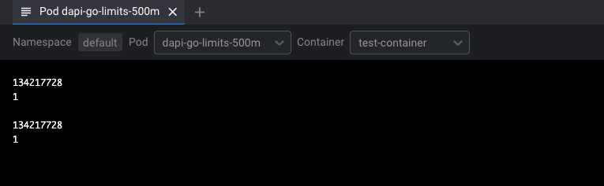
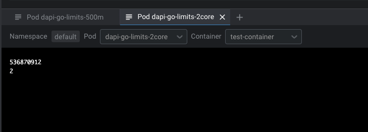
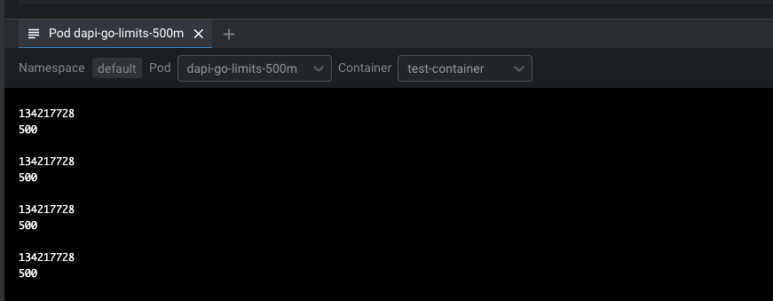

# Kubernetes resourceFieldRef:

we can use `resourceFieldRef` to retrive resource value such as `limits.cpu`

ex. [deployment-500m.yaml](./deployment-500m.yaml)
```yaml
apiVersion: v1
kind: Pod
metadata:
  name: dapi-go-limits-500m
  namespace: default
spec:
  containers:
    - name: test-container
      image: registry.k8s.io/busybox
      resources:
        limits:
          memory: 128Mi
          cpu: "500m"
      command: [ "sh", "-c"]
      args:
      - while true; do
          echo -en '\n';
          printenv GOMEMLIMIT;
          printenv GOMAXPROCS;
          sleep 10;
        done;
      env:
        - name: GOMEMLIMIT
          valueFrom:
            resourceFieldRef:
              containerName: test-container
              resource: limits.memory
        - name: GOMAXPROCS
          valueFrom:
            resourceFieldRef:
              containerName: test-container
              resource: limits.cpu
  restartPolicy: Never
```

when execute 
```sh
kubectl create -f deployment-500m.yaml 
```

result


ex 2000m
```sh
kubectl create -f deployment-2core.yaml 
```
result


---

divisor on kubernetes
ex
```yaml
apiVersion: v1
kind: Pod
metadata:
  name: dapi-go-limits-500m
  namespace: default
spec:
  containers:
    - name: test-container
      image: registry.k8s.io/busybox
      resources:
        limits:
          memory: 128Mi
          cpu: "500m"
      command: [ "sh", "-c"]
      args:
      - while true; do
          echo -en '\n';
          printenv GOMEMLIMIT;
          printenv GOMAXPROCS;
          sleep 10;
        done;
      env:
        - name: GOMEMLIMIT
          valueFrom:
            resourceFieldRef:
              containerName: test-container
              resource: limits.memory
        - name: GOMAXPROCS
          valueFrom:
            resourceFieldRef:
              containerName: test-container
              resource: limits.cpu
              divisor: 1m
  restartPolicy: Never
```
when execute 
```sh
kubectl create -f deployment-500m-with-divisor.yaml
```
result

